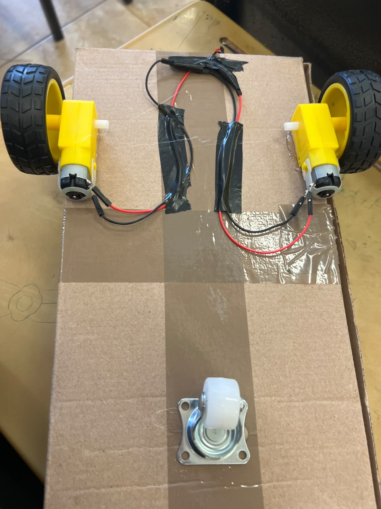

# CarritoSolar

## Nombre del proyecto
Flujo de energía Carro panel solar

## Descripción
Se realizó un carro capaz de avanzar haciendo uso de un panel solar

## Objetivos del aprendizaje
Utilizar correctamente voltajes, motorreductores, soldadura, cableado y panel solar, asi como aprender a aprovechar la energía solar

## Material utilizado
- 2 motorreductores
- Cautín(estaño, pasta para soldar)
- Jumpers
- Panel solar
- Cargador USB
- Caja de cartón
- Rueda loca

## Diagrama del circuito

## Video del funcionamiento
- https://www.youtube.com/shorts/gCr9snlNsw4

## Reporte
- 

## Conclusiones

La realización de este proyecto permitió poner en práctica conocimientos de electrónica, cableado y aprovechamiento de la energía solar. A través de la construcción del carrito se comprendió mejor el funcionamiento de los motorreductores y la importancia de utilizar correctamente los voltajes y conexiones. Finalmente, se logró construir un carrito funcional capaz de desplazarse utilizando la energía proporcionada por un panel solar
